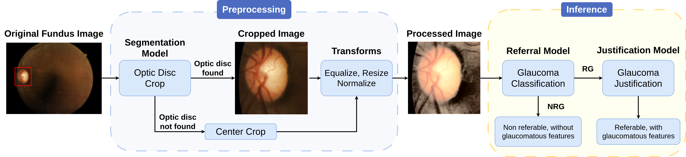

# sipaim2024-glaucoma
This repository contains the code for the SIPAIM 2024 paper 'Automatic Glaucoma Classification and Justification Using a Large and Diverse Dataset'.

<!-- diagram image -->


# Pre-requisites

## Conda environment
We use [conda](https://conda.io/) to manage the project dependencies. To create the environment, run the following commands:
```bash
conda env create -n sipaim python=3.9
conda install pytorch torchvision torchaudio pytorch-cuda=11.8 -c pytorch -c nvidia
conda install matplotlib onnx pandas plotly pydantic pydantic-core pyyaml simpleitk tifffile timm torchmetrics tqdm wandb scikit-learn -c conda-forge
pip install albumentations onnxruntime-gpu scikit-image scipy grad-cam protobuf==3.20.*
```

## Dataset
The dataset used in this project is the [JustRAIGS Challenge](https://justraigs.grand-challenge.org/). The dataset is publicly available and can be downloaded from [Zenodo](https://zenodo.org/records/10035093). After downloading the dataset, add the uncropped images to the `data` directory as shown below:
```
data/
    ├── JustRAIGS/
    │   ├── uncropped/
    │   │   ├── original, uncropped .jpg images here
    │   ├── cropped/
    │   │   ├── cropped images will be stored here
    │   ├── JustRAIGS_Train_labels.csv
```
Extract the original, uncropped images to the `uncropped` directory. Place `JustRAIGS_Train_labels.csv`  at the root of the `data/JustRAIGS` directory. The cropped images can be generated by the `crop.py` script, which will store the cropped images in the `cropped` directory.

# Data Cropping
To crop the images, run the following command:
```bash
python crop.py
```
The script utilizes a pretrained optic disc segmentation model called M-Net, developed by H. Fu et al. [1-2]. The code was adapated from the [MNet_DeepCDR](https://github.com/HzFu/MNet_DeepCDR) repository.

Before running the script, download the pretrained weights from [here](https://github.com/HzFu/MNet_DeepCDR/blob/e094023d5390ffc1606aba682e48eacf272fdba9/mnet_deep_cdr/deep_model/Model_DiscSeg_ORIGA.h5), convert the tensorflow weight to the onnx format using the [this tool](https://onnxruntime.ai/docs/tutorials/tf-get-started.html) and place the resulting  `Model_DiscSeg_ORIGA.onnx`file in the directory: `src/models/segmentation/model_files/`.

# Training
To train the model, run the following command:
```bash
python train.py --config configs/config.yaml
```
where `config.yaml` is one of the configuration files in the `configs` directory. The training script uses [WandB](https://wandb.ai/) to save the training logs and checkpoints in the `wandb` directory. 

If you wish to quickly test if the code is working, you can use the `--dry-run` flag to train the model for a single iteration:
```bash
python train.py --config configs/config.yaml --dry-run
```

# Evaluation
To evaluate the model, run the following command:
```bash
python test_model.py --config configs/config.yaml --checkpoint path/to/checkpoint.pth
```
where `path/to/checkpoint.pth` is the path to the checkpoint file. The script will use the config file inside the checkpoint to load the model and evaluate it on the test set, using the metrics specified in the config file.

Additionaly, you can use the `--grad-cam` flag to generate Grad-CAM visualizations for the model predictions:
```bash
python test_model.py --config configs/config.yaml --checkpoint path/to/checkpoint.pth --grad-cam
``` 
The Grad-CAM visualizations will be saved in the `cam_images` directory.

# References
1. Huazhu Fu, Jun Cheng, Yanwu Xu, Damon Wing Kee Wong, Jiang Liu, and Xiaochun Cao, "Joint Optic Disc and Cup Segmentation Based on Multi-label Deep Network and Polar Transformation", IEEE Transactions on Medical Imaging (TMI), vol. 37, no. 7, pp. 1597–1605, 2018. [[PDF]](https://arxiv.org/abs/1801.00926)  
2. Huazhu Fu, Jun Cheng, Yanwu Xu, Changqing Zhang, Damon Wing Kee Wong, Jiang Liu, and Xiaochun Cao, "Disc-aware Ensemble Network for Glaucoma Screening from Fundus Image", IEEE Transactions on Medical Imaging (TMI), vol. 37, no. 11, pp. 2493–2501, 2018. [[PDF]](http://arxiv.org/abs/1805.07549)
